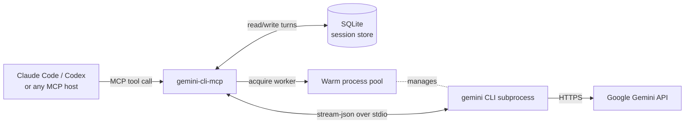

# gemini-cli-mcp

[](https://www.npmjs.com/package/@guibarscevicius/gemini-cli-mcp)
[](https://github.com/guibarscevicius/gemini-cli-mcp/actions/workflows/ci.yml)
[](LICENSE)

Use Gemini's free tier as an on-demand code reviewer from inside Claude Code, Codex, or any MCP-compatible host. `gemini-cli-mcp` wraps the official [`@google/gemini-cli`](https://github.com/google-gemini/gemini-cli) and exposes it through the Model Context Protocol — so you can ask Gemini to second-opinion a diff, pair-review a refactor, or scan a long file without leaving your primary agent.

Stateful multi-turn sessions, async jobs, response streaming, and a warm process pool keep latency low enough to be worth using.

## Why I built this

I use Claude Code and Codex daily for real work, and I have free Gemini access through my employer. Gemini is genuinely good at long-context reading and at noticing things a different model would miss — but switching tabs to ask it costs flow.

So I made it a tool call. Now my primary agent can hand Gemini a diff, a directory, or a question and keep going. It's not a replacement for either model — it's a cheap second opinion, on demand, in the same loop.

The interesting engineering is the boring stuff: warm process pools so the 12-second cold start doesn't stall the agent, SQLite-backed sessions so multi-turn actually works, and a workspace-scoped `@file` expander so you can hand Gemini a whole subdirectory in one prompt.

## Architecture



The MCP server keeps a small pool of pre-spawned `gemini` CLI processes hot, so a request typically completes in ~4–5 s instead of ~17 s — eliminating the ~12 s cold-start overhead. Multi-turn history is stored in SQLite (`node:sqlite`, no native deps) and replayed as structured context on every `gemini-reply`.

## Quick Setup (recommended)

```bash
npm install -g @guibarscevicius/gemini-cli-mcp
gemini-cli-mcp --setup
```

The wizard will:
1. Find or install `@google/gemini-cli`
2. Verify your Gemini authentication
3. Print a ready-to-paste MCP config with absolute paths

## Security

| Property | Implementation |
|----------|----------------|
| No shell injection | `spawn()` (via `spawnInGroup`) passes args as an array directly to `execve` — no shell is invoked |
| No arg concatenation | Args array is built programmatically; user input is always a single element |
| Env isolation | Subprocess inherits only `HOME` and `PATH` |
| Structured output | `--output-format stream-json` produces reliable streaming NDJSON |

## Prerequisites

- **Node.js ≥ 24** — [nodejs.org/en/download](https://nodejs.org/en/download)
- **Gemini CLI** installed and authenticated:

```bash
npm install -g @google/gemini-cli
gemini  # follow the auth flow (Google subscription — no billing required)
```

Verify it works:
```bash
gemini --prompt "hello" --output-format stream-json
```

## Installation

### npx (recommended)

```json
{
  "mcpServers": {
    "gemini": {
      "command": "npx",
      "args": ["-y", "@guibarscevicius/gemini-cli-mcp"]
    }
  }
}
```

Add to `~/.claude/settings.json` for Claude Code CLI, or your host's MCP config file.

### Local development

```json
{
  "mcpServers": {
    "gemini": {
      "command": "node",
      "args": ["/path/to/gemini-cli-mcp/dist/index.js"]
    }
  }
}
```

> **Model compatibility (Gemini CLI ≥ 0.31):** The CLI forces `include_thoughts` for models that support thinking. Recommended models: `gemini-3-flash-preview` (fast, default), `gemini-3-pro-preview` (deep reasoning), and `gemini-2.5-flash-lite` (lowest-cost throughput). `gemini-3.1-pro-preview` may appear for eligible users as a rolling preview upgrade.

## Tools

### `ask-gemini` — start a new session

```
Input:
  prompt        string   Required. The message to send.
  model         string   Optional. E.g. "gemini-3-flash-preview". Defaults to CLI default.
  cwd           string   Optional. Working directory — required for any @file path.
  wait          boolean  Optional. Block until done and return response inline (default: false).
  waitTimeoutMs number   Optional. Max ms to wait when wait=true (default: 90000).
  expandRefs    boolean  Optional. Set to false to disable @file expansion (e.g. Vue @click syntax). Default: true.

Output (async — default):
  jobId          string   Poll with gemini-poll or cancel with gemini-cancel.
  sessionId      string   Use with gemini-reply for multi-turn conversations.
  pollIntervalMs number   Suggested polling interval in ms (2000).

Output (wait: true — done):
  jobId          string
  sessionId      string
  response       string   Gemini's complete response.
  pollIntervalMs number

Output (wait: true — timeout):
  jobId           string
  sessionId       string
  partialResponse string   Partial output collected before timeout (may be empty).
  timedOut        true
  pollIntervalMs  number
```

### `gemini-reply` — continue an existing session

```
Input:
  sessionId     string   Required. Returned by ask-gemini.
  prompt        string   Required. Follow-up message.
  model         string   Optional. Override the model for this turn.
  cwd           string   Optional. Working directory for relative @file paths.
  wait          boolean  Optional. Block until done (default: false).
  waitTimeoutMs number   Optional. Max ms to wait when wait=true (default: 90000).
  expandRefs    boolean  Optional. Set to false to disable @file expansion. Default: true.

Output:
  jobId              string
  pollIntervalMs     number
  response           string   (wait: true — done)
  partialResponse    string   (wait: true — timeout)
  timedOut           true     (wait: true — timeout)
  historyTruncated   boolean  Present and true when older turns were dropped due to GEMINI_MAX_HISTORY_TURNS.
  historyTurnCount   number   Total turns in the session at the time of this reply (present when historyTruncated is true).
```

Sessions auto-expire after 60 minutes of inactivity.

### `gemini-poll` — check job status

```
Input:
  jobId   string   Required. From ask-gemini or gemini-reply output.

Output (pending):
  jobId           string
  status          "pending"
  partialResponse string   Partial output accumulated so far.

Output (done):
  jobId    string
  status   "done"
  response string   Gemini's complete response.

Output (error):
  jobId   string
  status  "error"
  error   string

Output (cancelled):
  jobId   string
  status  "cancelled"
  error   string   Optional cancellation detail.
```

### `gemini-cancel` — cancel a pending job

```
Input:
  jobId   string   Required.

Output:
  jobId       string
  cancelled   boolean   true if the running subprocess was killed.
  alreadyDone boolean   true if the job had already completed before cancel arrived.
```

### `gemini-health` — server health and diagnostics

```
Input:
  (none)

Output:
  binary.path         string | null   Absolute path to the gemini binary (null if only "gemini" on PATH).
  env                 object          Active env overrides (GEMINI_MAX_CONCURRENT, etc.). Empty if all defaults.
  pool.enabled        boolean         Whether the warm process pool is active.
  pool.ready          number          Processes currently ready in the pool.
  pool.size           number          Configured pool size.
  pool.lastError      string | null   Last spawn error message (null when healthy).
  pool.consecutiveFailures number     Consecutive spawn failures since last success.
  concurrency.max     number          GEMINI_MAX_CONCURRENT value.
  concurrency.active  number          Currently running Gemini subprocesses.
  concurrency.queued  number          Requests waiting for a concurrency slot.
  jobs.active         number          Jobs currently in "pending" state.
  jobs.total          number          Total jobs tracked (all statuses).
  jobs.byStatus       object          Counts by status: { pending, done, error, cancelled }.
  sessions.total      number          Total sessions in the store.
  server.uptime       number          Process uptime in seconds.
  server.version      string          Package version.
  cli.version            string | null   Detected CLI version (e.g. "0.34.0").
  cli.minSupported       string          Minimum supported version ("0.30.0").
  cli.versionOk          boolean         Whether the detected version meets the minimum.
  cli.detectedFlags      number          Number of flags found in --help output.
  cli.activeAdaptations  array           Flag adaptations in effect (e.g. "--approval-mode yolo (replaces --yolo)").
  cli.detectionError     string | null   Error message if detection failed.
```

### `gemini-sessions` — list or export sessions

The discriminator is the presence of `sessionId`: omit it to list active
sessions; provide it to export that session's full conversation history.

```
Input:
  sessionId   string   Optional. When omitted, returns the list of active sessions.
                       When provided, returns the full conversation history of that session.
  format      string   Optional. "json" (default) or "markdown". Only used with sessionId.
  lastN       number   Optional. Export only the last N turns. Only used with sessionId.

Output (no sessionId — list path):
  sessions   array    Array of session objects, sorted by most recently accessed.
    id             string   Session ID (pass back as sessionId to export this session).
    lastAccessed   number   Unix-ms timestamp of the last turn.
    turnCount      number   Number of turns stored in the session.
    expiresAt      number   Unix-ms timestamp when the session will expire (60 min after lastAccessed).
  total      number   Total number of sessions.

Output (with sessionId — export path):
  sessionId       string   The exported session ID.
  turnCount       number   Number of turns included in the export.
  totalTurnCount  number   Total turns in the session (present only when lastN is used).
  format          string   The format used ("json" or "markdown").
  turns           array    Array of { role, content } objects.
  content         string   Pre-rendered representation in the requested format
                           (JSON.stringify of turns, or bold-label markdown paragraphs).
  exportedAt      string   ISO 8601 timestamp of the export.
```

### `gemini-batch` — parallel prompt processing

```
Input:
  prompts      array    Required. Array of prompt strings to process in parallel.
  model        string   Optional. Model to use for all prompts.
  cwd          string   Optional. Working directory for @file references.
  expandRefs   boolean  Optional. Set to false to disable @file expansion. Default: true.
  wait         boolean  Optional. Block until all jobs complete (default: true).

Output (wait: true — default):
  results   array    Array of result objects, one per prompt (in order):
    index     number    Position in the input prompts array.
    status    string    "done" or "error".
    response  string    Gemini's response (present when status is "done").
    error     string    Error message (present when status is "error").
  summary   object   { total, succeeded, failed, durationMs } counts and elapsed time.

Output (wait: false):
  jobs           array    Array of { jobId, index } objects — one per prompt.
  pollIntervalMs number   Suggested polling interval in ms (2000).
```

### `gemini-research` — deep research with grounding

Uses Gemini's built-in research capabilities for queries requiring up-to-date information or multi-source synthesis.

```
Input:
  query         string   Required. The research question or topic.
  depth         string   Optional. "quick", "standard" (default), or "deep".
  model         string   Optional. Defaults to CLI default.
  cwd           string   Optional. Working directory for @file references.
  expandRefs    boolean  Optional. Set to false to disable @file expansion. Default: true.
  wait          boolean  Optional. Block until done (default: true).
  waitTimeoutMs number   Optional. Max ms to wait when wait=true (default: 90000 for quick/standard, 180000 for deep).

Output (wait: true — done, default):
  jobId          string
  response       string   Gemini's complete research response.
  pollIntervalMs number

Output (wait: true — timeout):
  jobId           string
  partialResponse string   Partial output collected before timeout (may be empty).
  timedOut        true
  pollIntervalMs  number

Output (wait: false — async):
  jobId          string   Poll with gemini-poll or cancel with gemini-cancel.
  pollIntervalMs number   Suggested polling interval in ms (2000).
```

## Resources

Read-only data exposed via the MCP Resources API (no tool call required — hosts can cache by URI).

### `gemini://models` — available Gemini models

Returns the curated list of Gemini models with tier (`fast` / `balanced` / `deep`),
description, and notes. Honors the `GEMINI_MODELS` env var (comma-separated IDs)
as an override; when set, returned models have `source: "custom"` and `tier: "balanced"`.

```
Output:
  models  array of { id, description, tier, notes }
  total   number
  source  "curated" | "custom"
```

### `gemini://server/health`, `gemini://sessions`, `gemini://jobs`

Runtime diagnostics, active session list, and pending job list respectively.
Templates `gemini://sessions/{sessionId}` and `gemini://jobs/{jobId}` return
detail for a specific session or job.

## Async workflow

`ask-gemini` returns immediately with a `jobId`. Use `gemini-poll` to check status:

```javascript
// Start a long request without blocking
const { jobId, sessionId } = await ask_gemini({
  prompt: "Summarize this large codebase: @src/**/*.ts",
  cwd: "/path/to/your/project"
})

// Poll until done (typically 4–20 s)
let result
do {
  await new Promise(r => setTimeout(r, 2000))
  result = await gemini_poll({ jobId })
} while (result.status === "pending")

// Continue the conversation
const { jobId: j2 } = await gemini_reply({
  sessionId,
  prompt: "What are the 3 most important findings?"
})
```

For simple one-shot requests, use `wait: true`:

```javascript
const { response } = await ask_gemini({
  prompt: "What is the capital of France?",
  wait: true
})
```

## Using `@file` syntax

The server supports `@file` references to inject file contents directly into the prompt.

> **Always pass `cwd`** — the server enforces a workspace boundary at `cwd`. Any `@file` path that resolves outside the tree is rejected with `Path not in workspace`.

**Single file:**
```javascript
ask_gemini({ prompt: "Review this file: @src/auth.ts", cwd: "/path/to/your/project" })
```

**Multiple files** — when two or more `@file` tokens are present and `cwd` is provided, the server expands them before sending to the CLI:
```javascript
ask_gemini({
  prompt: "Compare @src/auth.ts and @src/session.ts for consistency.",
  cwd: "/path/to/your/project"
})
```

**Glob patterns:**
```javascript
ask_gemini({
  prompt: "Review all TypeScript files: @src/**/*.ts",
  cwd: "/path/to/your/project"
})
```

Without `cwd`, only a single `@file` is supported (passed directly to the CLI). Multiple `@file` tokens without `cwd` raise an error.

## Multi-turn example

```javascript
// Turn 1
const { sessionId } = await ask_gemini({
  prompt: "What is the time complexity of merge sort?",
  wait: true
})

// Turn 2 — Gemini has full context of the previous exchange
const { response } = await gemini_reply({
  sessionId,
  prompt: "And how does that compare to quicksort in practice?",
  wait: true
})
```

## Performance

The server pre-spawns Gemini CLI processes (warm pool) to eliminate the ~12 s cold-start cost. First requests arrive in ~4–5 s once the pool has warmed up (~12 s after server start).

Set `GEMINI_POOL_STARTUP_MS` to match your machine's CLI startup time. Disable the pool with `GEMINI_POOL_ENABLED=0` for debugging.

### Per-instance cost

Every MCP client (each Claude Code window, Codex CLI session, editor, etc.) spawns its own `gemini-cli-mcp` server, and each server keeps its own warm pool. The total warm-process count on the box is roughly:

```
warm workers ≈ (open MCP clients) × (gemini-cli-mcp configs per client) × GEMINI_POOL_SIZE
```

Defaults are tuned for the multi-instance common case: `GEMINI_POOL_SIZE=1` keeps a single warm slot per server, and `GEMINI_POOL_IDLE_TIMEOUT_MS=300000` evicts idle workers down to `GEMINI_POOL_MIN_SIZE=0` after 5 min — so a developer with several open editors does not pay for warm pools they aren't using.

If you raise `GEMINI_POOL_SIZE` above 1 for parallel batch work (`gemini-batch`, concurrent reviews), idle eviction reclaims the cost during quiet windows. To keep N slots permanently warm, set `GEMINI_POOL_MIN_SIZE=N`. To disable eviction entirely, set `GEMINI_POOL_IDLE_TIMEOUT_MS=0`.

## Limitations

- **Free-tier rate limits apply** — Google's quotas govern, not this server. Heavy parallel workloads (`gemini-batch` with many prompts) will hit them; tune `GEMINI_MAX_CONCURRENT` accordingly.
- **Cold-start latency on first request** — the first prompt after server start waits up to ~12 s for a warm-pool slot. Subsequent requests are ~4–5 s.
- **No streaming pass-through to the host** — responses are accumulated and returned whole. Async jobs let you poll for partial output, but there's no token-by-token stream into Claude Code/Codex (the MCP spec doesn't expose one yet).
- **Requires an authenticated `gemini` CLI on the same machine** — the server shells out to the official CLI, so OAuth state lives in `~/.config/gemini`. This is not a remote API client; if you need that, talk to the Gemini API directly.

## Environment variables

All variables are optional.

| Variable | Default | Description |
|----------|---------|-------------|
| `GEMINI_MAX_RETRIES` | `3` | Auto-retries on empty-stdout/429/ETIMEDOUT. `0` = disabled. |
| `GEMINI_RETRY_BASE_MS` | `1000` | Base delay for exponential backoff (doubles each retry). |
| `GEMINI_MAX_CONCURRENT` | `2` | Max parallel Gemini subprocesses. |
| `GEMINI_QUEUE_TIMEOUT_MS` | `60000` | Max wait for a concurrency slot (ms). |
| `GEMINI_STRUCTURED_LOGS` | `0` | `1` = emit one JSON telemetry line to stderr per request. |
| `GEMINI_MAX_HISTORY_TURNS` | `20` | Session history window (turn-pairs). `0` = unlimited. |
| `GEMINI_SESSION_DB` | `~/.gemini-cli-mcp/sessions.db` | SQLite path. `:memory:` = ephemeral. |
| `GEMINI_CACHE_TTL_MS` | `300000` | Response cache TTL (ms). `0` = disabled. |
| `GEMINI_CACHE_MAX_ENTRIES` | `50` | Max entries in the response cache. |
| `GEMINI_POOL_ENABLED` | `1` | `0` = disable warm pool (cold spawn only). |
| `GEMINI_POOL_SIZE` | `1` | Number of pre-spawned warm processes per server. See [Per-instance cost](#per-instance-cost) before raising. |
| `GEMINI_POOL_STARTUP_MS` | `12000` | Estimated CLI startup time (ms). Prompt writes are delayed by this amount after spawn. |
| `GEMINI_POOL_IDLE_TIMEOUT_MS` | `300000` | Time of no `acquire()` calls after which the pool shrinks to `GEMINI_POOL_MIN_SIZE`. `0` disables eviction. |
| `GEMINI_POOL_MIN_SIZE` | `0` | Floor the pool can shrink to during idle eviction. Must be ≤ `GEMINI_POOL_SIZE`. |
| `GEMINI_BINARY` | (auto-discovered) | Explicit path to the `gemini` binary. When set, auto-discovery is skipped entirely. Useful when gemini is installed via nvm/fnm and not on the PATH that MCP servers see. |
| `GEMINI_JOB_TTL_MS` | `300000` | How long completed/failed/cancelled jobs are retained (ms). |
| `GEMINI_JOB_GC_MS` | `60000` | Job garbage-collection interval (ms). |
| `GEMINI_SKIP_DETECTION` | `0` | `1` = skip CLI version/flag detection at startup (use hardcoded defaults). |
| `GEMINI_MODELS` | (built-in list) | Comma-separated model IDs to override the default curated list exposed by the `gemini://models` resource. Custom entries are reported with `source: "custom"`, `tier: "balanced"`, and `description: "Custom model"`. |
| `GEMINI_DISABLE_PDEATHSIG` | `0` | `1` = skip the `setpriv --pdeathsig TERM` wrapper around child spawns (Linux only). Escape hatch for the issue #97 PDEATHSIG safety net; only the literal string `"1"` disables. |
| `GEMINI_ORPHAN_REAPER` | `1` | `0` = disable the issue #99 startup sweep that reaps orphaned `gemini --yolo --output-format stream-json` workers belonging to the current user. POSIX-only; no-op on Windows. |

## CLI compatibility

The server automatically detects the installed Gemini CLI version and available flags at startup. This allows it to adapt to upstream changes — for example, using `--approval-mode yolo` when available instead of the deprecated `--yolo` flag.

Detection runs once on first use and is cached for the server's lifetime. If detection fails (e.g., binary not found), the server falls back to the legacy `--yolo` flag.

The `gemini-health` tool reports detection results in its `cli` field:

```
cli.version            string | null   Detected CLI version (e.g. "0.34.0").
cli.minSupported       string          Minimum supported version ("0.30.0").
cli.versionOk          boolean         Whether the detected version meets the minimum.
cli.detectedFlags      number          Number of flags found in --help output.
cli.activeAdaptations  array           Flag adaptations in effect (e.g. "--approval-mode yolo (replaces --yolo)").
cli.detectionError     string | null   Error message if detection failed.
```

Set `GEMINI_SKIP_DETECTION=1` to bypass detection entirely and use hardcoded defaults.

### Upstream tracking

A GitHub Actions workflow (`.github/workflows/upstream-watch.yml`) runs weekly to check for new `@google/gemini-cli` releases. When a new version is detected, it opens a tracking issue with a review checklist.

When refreshing to a new upstream CLI version, use this acceptance flow:

```bash
npm run build
npm run test -- tests/cli-capabilities.test.ts tests/resources.test.ts tests/prompts.test.ts tests/logging.test.ts tests/index-server.test.ts
npm run test:smoke
npm test
```

`npm run test:smoke` performs a real stdio MCP session against `dist/index.js` and requires a working authenticated `gemini` CLI on your machine.

## Troubleshooting

**`gemini binary not found at '...'`** — Run `gemini-cli-mcp --setup` to auto-detect the binary and verify auth. Or install the Gemini CLI manually: `npm install -g @google/gemini-cli`

**`HOME environment variable is not set`** — The Gemini CLI needs `HOME` to locate OAuth credentials (`~/.config/gemini`).

**`Path not in workspace`** — Pass `cwd` equal to the root of your project when using `@file` paths.

**`Gemini request timed out waiting for a concurrency slot`** — Increase `GEMINI_MAX_CONCURRENT` or reduce request concurrency.

**Sessions expire** — Sessions auto-expire after 60 minutes of inactivity. Start a new session with `ask-gemini`.

**Warm pool not starting** — Check stderr for `gemini binary not found`. After 5 consecutive spawn failures the pool disables itself and logs a diagnostic message.

### gemini binary not found (nvm/fnm users)

If you use nvm or fnm, the `gemini` binary may not be on the PATH that Claude Code sees (MCP servers start in non-interactive shells where version managers don't load).

**Option A (recommended):** Run `gemini-cli-mcp --setup` — it auto-discovers the binary and generates a config with `GEMINI_BINARY` set.

**Option B (manual):** Set `GEMINI_BINARY` in your MCP config env:
```json
{
  "gemini": {
    "command": "...",
    "args": ["..."],
    "env": {
      "GEMINI_BINARY": "/home/you/.nvm/versions/node/v24.0.0/bin/gemini"
    }
  }
}
```

## How sessions work

The server manages conversation history in a local SQLite store (`node:sqlite`). On each `gemini-reply` call, prior turns are prepended as a structured context block:

```
[Conversation history]
User: <turn 1 prompt>
Assistant: <turn 1 response>
...
[End of history — continue the conversation]

<new prompt>
```

## Development

```bash
git clone https://github.com/guibarscevicius/gemini-cli-mcp.git
cd gemini-cli-mcp
npm install
npm run build
npm test
```

Smoke test:
```bash
echo '{"jsonrpc":"2.0","id":1,"method":"tools/list","params":{}}' | node dist/index.js
```

> **Note:** `npx @guibarscevicius/gemini-cli-mcp` will not work from inside this repo. npm's Arborist sees the local `package.json` matches the package name and skips installation. Use `node dist/index.js` directly when developing.

## License

MIT — see [LICENSE](LICENSE).
